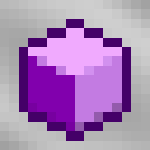

# dSchema

A specialized fork of Huskuraft's [Effortless Structure](https://github.com/huskuraft/effortless).

> **Note:** This fork is for a specific modpack. Support will only be provided through the modpack itself. For general feature requests, bug fixes, or ports, please refer to the original author.

## Added Features

*   Tier-based permission system.
*   Player-specific permission overrides.
*   In-game command (`/schematier`) for tier management.

## Configuration (`config/dschema.toml`)

```toml

[global]
#Should use commands to build using this mod.
useCommands = false
#Should allow players to use this mod.
allowUseMod = true
#Should allow players to break blocks using this mod.
allowBreakBlocks = true
#Should allow players to place blocks using this mod.
allowPlaceBlocks = true
#Should allow players to interact blocks using this mod.
allowInteractBlocks = true
#Should allow players to copy and paste structures using this mod.
allowCopyPasteStructure = true
#Should allow players to break blocks with proper tools only in survival mode.
useProperToolsOnly = true
#The maximum distance a player can reach when building using this mod. 
#Range: 0 ~ 32767
maxReachDistance = 128
#The maximum block volume a player can break at once when building using this mod. 
#Range: 0 ~ 1000000
maxBlockBreakVolume = 10000
#The maximum block volume a player can place at once when building using this mod. 
#Range: 0 ~ 1000000
maxBlockPlaceVolume = 10000
#The maximum block volume a player can interact at once when building using this mod. 
#Range: 0 ~ 1000000
maxBlockInteractVolume = 10000
#The maximum structure volume a player can copy and paste at once when building using this mod. 
#Range: 0 ~ 1000000
maxStructureCopyPasteVolume = 10000
#The list of items that players are allowed to break/place/interact when building using this mod. 
#If the whitelist is empty, all items are allowed. 
#If the whitelist is not empty, only the items in the whitelist are allowed. 
#The value must be a list of item resource locations like ["minecraft:stone", "minecraft:dirt"].
whitelistedItems = []
#The list of items that players are not allowed to break/place/interact when building using this mod. 
#If the blacklist is empty, no items are not allowed. 
#If an item exists both in the blacklist and the whitelist, it will not be allowed. 
#The value must be a list of item resource locations like ["minecraft:stone", "minecraft:dirt"].
blacklistedItems = []

[player]

[player.xxxxxxxx-xxxx-xxxx-xxxx-xxxxxxxxxxxx]
allowUseMod = true
allowBreakBlocks = true
allowPlaceBlocks = true
allowInteractBlocks = true
allowCopyPasteStructure = true
maxReachDistance = 16
maxBlockBreakVolume = 256
maxBlockPlaceVolume = 256
maxBlockInteractVolume = 256
maxStructureCopyPasteVolume = 256

[tiers]

[tiers.alpha]
allowUseMod = true
allowBreakBlocks = false
allowPlaceBlocks = true
allowInteractBlocks = false
allowCopyPasteStructure = false
maxReachDistance = 5
maxBlockPlaceVolume = 32

[tiers.beta]
allowUseMod = true
allowBreakBlocks = true
allowPlaceBlocks = true
allowInteractBlocks = true
allowCopyPasteStructure = false
maxReachDistance = 8
maxBlockBreakVolume = 64
maxBlockPlaceVolume = 64
maxBlockInteractVolume = 64

[tiers.gamma]
allowUseMod = true
allowBreakBlocks = true
allowPlaceBlocks = true
allowInteractBlocks = true
allowCopyPasteStructure = true
maxReachDistance = 16
maxBlockBreakVolume = 256
maxBlockPlaceVolume = 256
maxBlockInteractVolume = 256
maxStructureCopyPasteVolume = 256
```

## Commands

*   `/schematier set <player> <tier>`
*   `/schematier get <player>`
*   `/schematier clear <player>`

## Credits
*   **[Huskuraft](https://github.com/huskuraft)** - Author of Effortless Structures
*   **[Requioss](https://www.curseforge.com/members/requioss)** - Author of Effortless Building

## License

dSchema is licensed under LGPLv3.